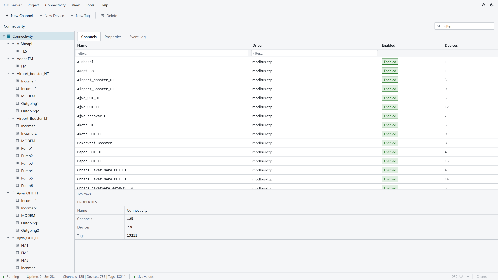
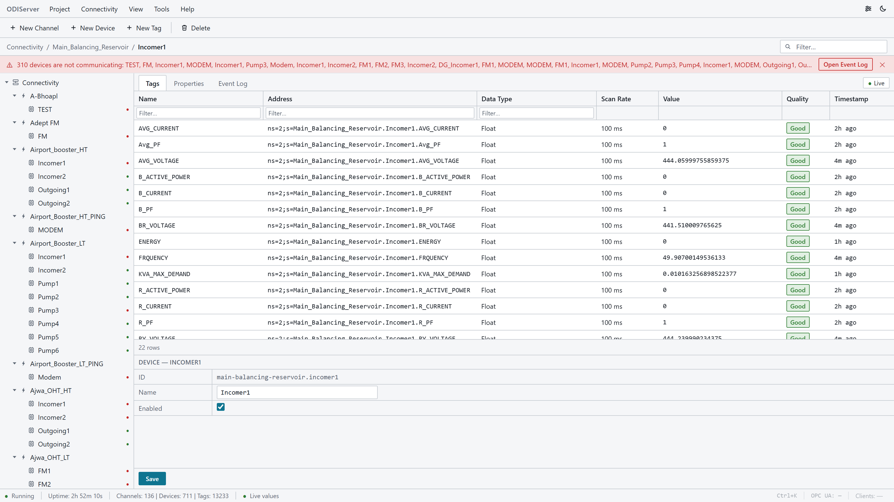
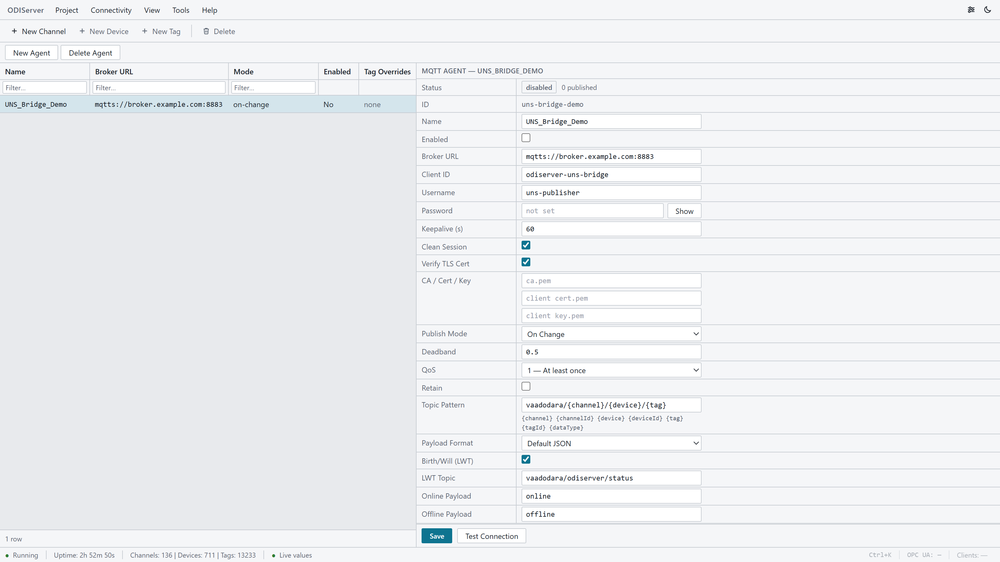
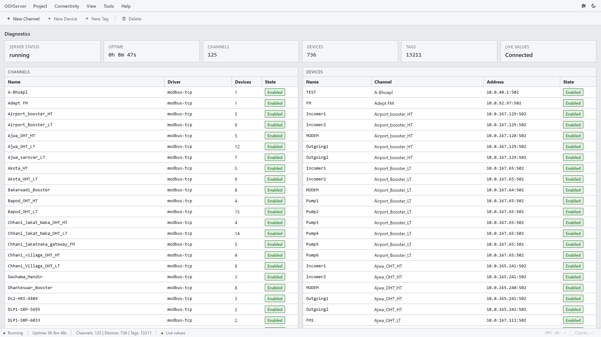
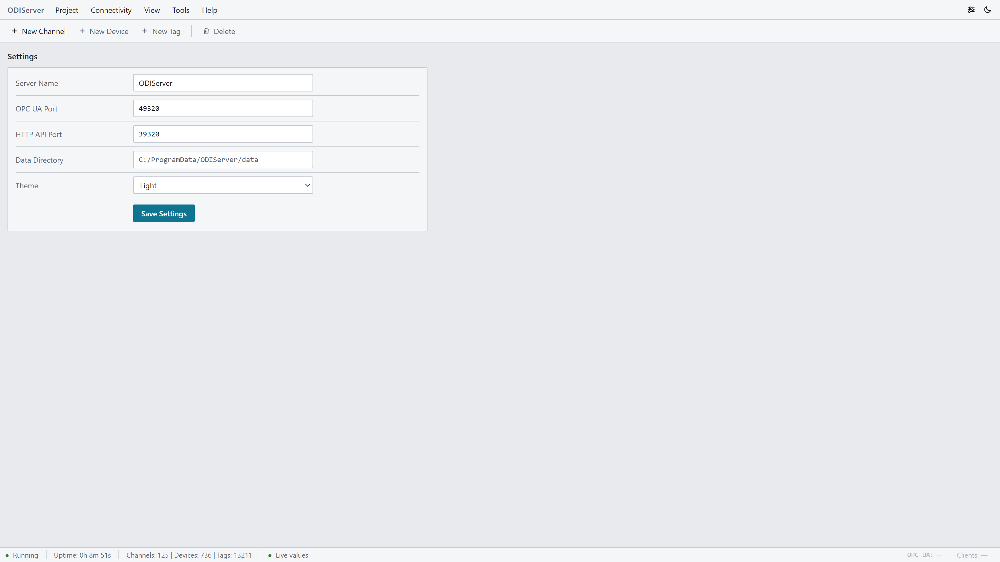
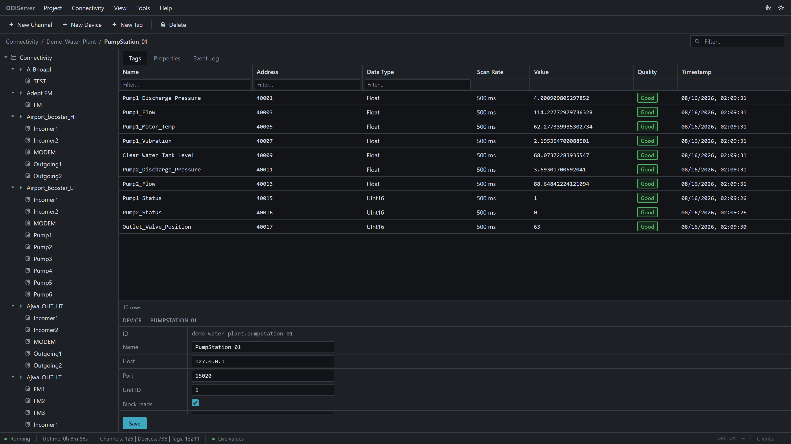

# ODIServer

**O**pen **D**ata & **I**nterface Server — an open-source, cross-platform industrial connectivity server. A KEPServerEX alternative built on an embedded Node-RED driver engine with a native TypeScript tag engine, an OPC UA server, and northbound MQTT publishing.

## Features

- **Channel / Device / Tag** configuration model
- **Southbound drivers**: Modbus TCP/RTU, OPC UA client with subscriptions and polling (S7, EtherNet/IP, BACnet planned)
- **Northbound**: OPC UA Server (node-opcua), MQTT publish agents (topic patterns, payload templates, timing modes, deadbands, per-tag overrides; Sparkplug B planned)
- **Tag engine**: scan groups, linear scaling, deadband, quality + timestamps
- **Web configuration console**: OT-style engineering tool UI (tree + grids + property inspector), light and dark themes
- **REST + WebSocket API** for integration
- **Server event log** with live streaming to the console
- **Importer plugins**: KEPServerEX JSON project import, extensible plugin folder format
- **Cross-platform**: Windows, Linux (x64/ARM64, incl. Raspberry Pi), macOS, Docker

## Architecture

Node-RED runs **embedded** as the southbound protocol-driver execution engine. Everything above the protocol layer — tag engine, northbound interfaces, REST/WebSocket API, web console — is native TypeScript.

```
┌────────────────────────── ODIServer process ──────────────────────────┐
│  Web Config Console (React) ──► REST + WebSocket API (Express)        │
│                                │                                      │
│                     Configuration Store (SQLite)                      │
│                                │                                      │
│                        Tag Engine (in-memory)                         │
│                     scan groups · scaling · deadband                  │
│                     quality + timestamp · change events               │
│                       ▲                    │                          │
│         Driver Bridge │                    ▼                          │
│   (custom Node-RED nodes,      Northbound services                    │
│    runtime-generated flows)    ├─ OPC UA Server (node-opcua)          │
│                       ▲        └─ MQTT publish agents (mqtt.js)       │
│        Embedded Node-RED runtime     topic patterns · payload         │
│        ├─ Modbus TCP/RTU driver (node-red-contrib-modbus)             │
│        └─ OPC UA client driver (node-red-contrib-opcua client)        │
└────────────────────────────────────────────────────────────────────────┘
         │ Modbus TCP/RTU              │ OPC UA
         ▼                             ▼
     PLCs / devices              existing OPC UA servers
```

### Where Node-RED is used vs. native libraries

| Layer | Technology | Why |
|---|---|---|
| **Southbound: Modbus TCP/RTU** | Embedded Node-RED + `node-red-contrib-modbus` (`packages/drivers/src/flow-gen.ts`) | Protocol I/O is Node-RED's strength; flows are generated from channel/device/tag config |
| **Southbound: OPC UA client** | Embedded Node-RED + `node-red-contrib-opcua` (subscriptions + polling) | Same as above |
| **Driver bridge** | Custom Node-RED nodes (`packages/drivers/nodered/`: `odi-tag-in/out`, `odi-opcua-in/out/sub`) | Push raw values into the tag engine, write-back out to drivers |
| **Northbound: OPC UA server** | `node-opcua` natively (`packages/server/src/opcua-server.ts`) | Full control of address space, security policies, PKI |
| **Northbound: MQTT agents** | `mqtt.js` natively (`packages/server/src/mqtt/`) | Topic patterns, payload templates, timing modes, deadbands, LWT |
| **Tag engine, config store, API, web console** | Native TypeScript (`@odiserver/core`, `api`, `server`, `web`) | The tag layer is the product's core value |

### Packages

- `@odiserver/core` — config schema (zod), SQLite config store, in-memory tag engine, event bus, event log
- `@odiserver/drivers` — custom Node-RED bridge nodes + flow generator (Modbus, OPC UA client)
- `@odiserver/api` — Express REST + WebSocket API
- `@odiserver/server` — composition root; embeds Node-RED, hosts northbound OPC UA server and MQTT agents, serves web console
- `@odiserver/web` — React configuration console

See `docs/architecture.md` for the full design, configuration model, and phase roadmap.

## Status

Early development. Modbus and OPC UA southbound drivers, northbound OPC UA server and MQTT agents, web console, event log, and KEPServerEX project import are working end-to-end. See `docs/architecture.md` for the design and phase roadmap.

## Screenshots

The web configuration console (demo data from `scripts/mock-plant.mjs`, a Modbus TCP simulator):

| | |
| --- | --- |
|  [](https://app.fossa.com/projects/git%2Bgithub.com%2Fjigarladhava%2FODIServer?ref=badge_shield)
|  |
| *Connectivity overview: channel/device/tag tree, grids and property inspector* | *Tag grid: live values, quality badges and timestamps over WebSocket* |
|  |  |
| *Northbound MQTT agent: topic patterns, payload formats, QoS, deadband, LWT* | *Diagnostics: server status, channel and device health at a glance* |
|  |  |
| *Server settings: ports, data directory, theme* | *Dark theme* |

To regenerate: start the server (`npm run dev`), run `node scripts/mock-plant.mjs` in one terminal, then `node scripts/capture-screenshots.mjs` (requires `npm i --no-save puppeteer-core` and a local Chrome/Edge install).

## Development

```bash
npm install
npm run dev        # boots ODIServer (API + embedded Node-RED + web console)
npm test           # unit tests
npm run typecheck  # type-check all packages
```

## License

Apache-2.0. See `LICENSE`.


[](https://app.fossa.com/projects/git%2Bgithub.com%2Fjigarladhava%2FODIServer?ref=badge_large)